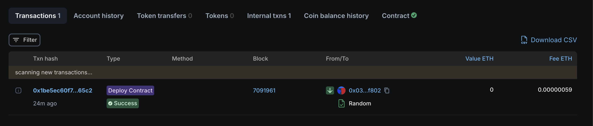
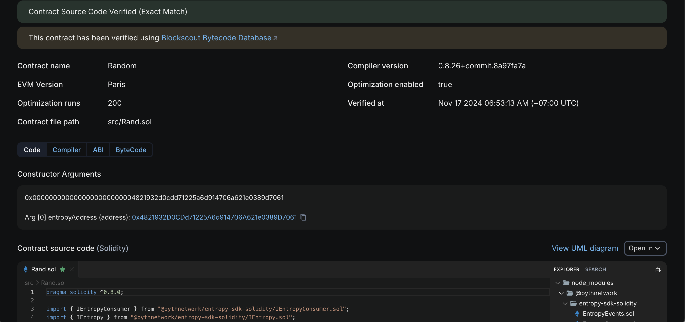

This contract used to generate a random number with pyth entropy was deployed

https://eth-sepolia.blockscout.com/address/0x152F1b5Cf847c89cCe710A89063d91dE523Be88A?tab=txs

And verified on blockscout

https://eth-sepolia.blockscout.com/address/0x152F1b5Cf847c89cCe710A89063d91dE523Be88A?tab=contract

