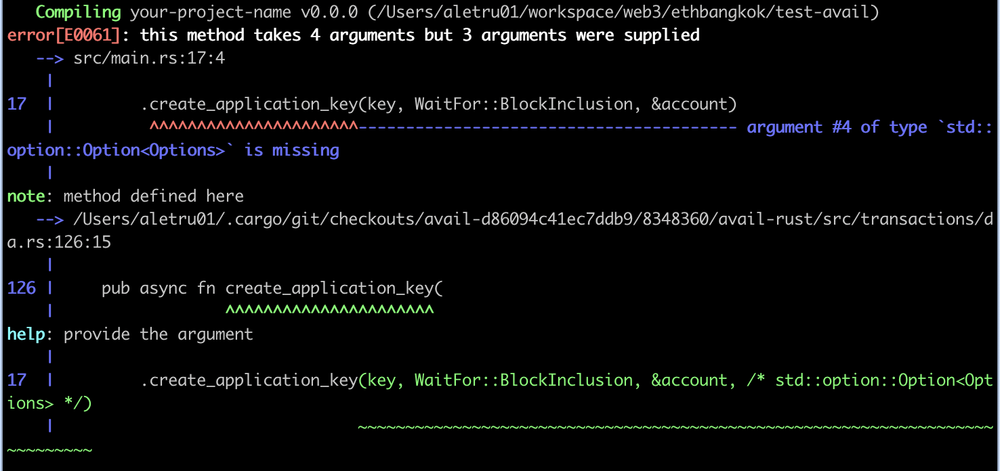
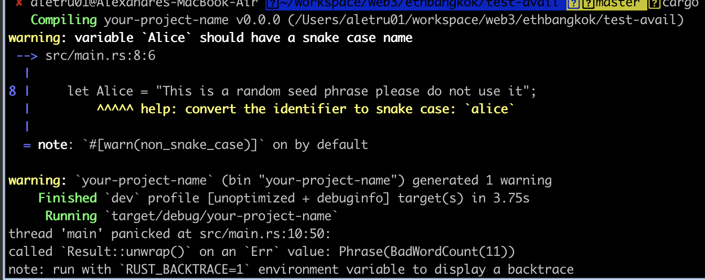
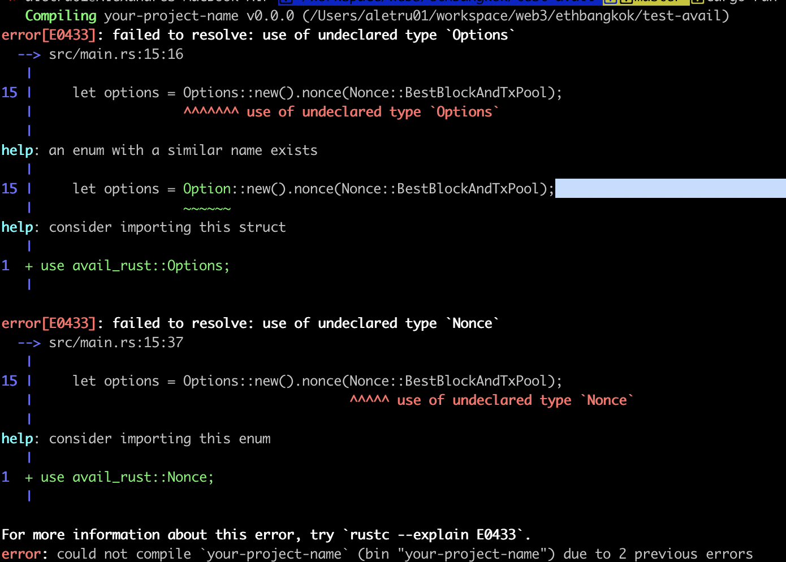
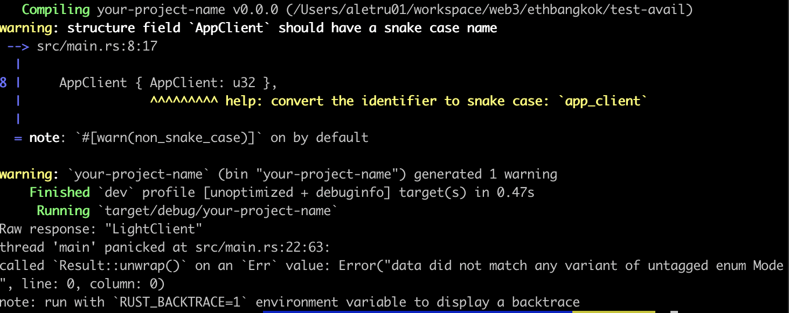

# avail-rust documentation findings

## Intro

This is feedback to avail-rust. The provided code in the documentation have errors, and I did some troubleshooting to find/fix them.
A lot of errors come from the same issues, so I'm going to first talk about the common errors and potentially how to fix them.
Then in the second part, I'll go step by step through the documentation and refer the error(s) it contains

## Common errors / feedback

<mark>Common error 1:</mark>



A 4th parameter is missing for a lot of functions:
```
   --> src/main.rs:17:4
    |
17  |         .create_application_key(key, WaitFor::BlockInclusion, &account)
    |          ^^^^^^^^^^^^^^^^^^^^^^---------------------------------------- argument #4 of type `std::option::Option<Options>` is missing
```
It can be replaced by `None` if not needed like:

```
.create_application_key(key, WaitFor::BlockInclusion, &account, None)
```

<mark>Common error 2:</mark>

From my investigation, the content of `Alice` is not the expected input.
Adding `//` at the beginning of the string will fix this runtime error (Similar to https://github.com/availproject/avail/blob/main/avail-rust/docs/utils/progress_transaction/src/main.rs#L9)



<br>

<mark>Feedback 3:</mark>

At runtime, I often get this message:
```
Error: "RPC error: ErrorObject { code: ServerError(1010), message: \"Invalid Transaction\", data: Some(RawValue(\"Inability to pay some fees (e.g. account balance too low)\")) }
```
I'd suggest to point to a documentation on how to add funds 


## 1.Create a new App ID on Avail DA

https://docs.availproject.org/api-reference/avail-node-api/da-create-application-key

The provided code doesn't compile. To fix it, check Common error 1.
After this fix, there's common error 2, then feedback 2

## 2.Submit new data to Avail DA

https://docs.availproject.org/api-reference/avail-node-api/da-submit-data

`Options` and `Nonce` are missing in the includes

You can fix it in line 1:

```
use avail_rust::{Data, Keypair, SecretUri, WaitFor, SDK, Options, Nonce};
```



Then, there's common error 2, feedback 3

## 3.Transfer funds while ensuring min balance for sender

https://docs.availproject.org/api-reference/avail-node-api/balances-transfer-keep-alive

Common error 1 with the function `transfer_keep_alive()`

Common error 2

Feedback 3

## 4.Transfer funds without ensuring min balance for sender

https://docs.availproject.org/api-reference/avail-node-api/balances-transfer-allow-death

Common error 1 with the function `transfer_allow_death()`

Common error 2

Feedback 3

## 5.Transfer all funds from one account to another

https://docs.availproject.org/api-reference/avail-node-api/balances-transfer-all

Common error 1 with the function `transfer_all()`

Common error 2

Feedback 3


## 6.Bond AVAIL tokens on Avail DA

https://docs.availproject.org/api-reference/avail-node-api/staking-bond

Common error 1 with the function `bond()`

Common error 2

Feedback 3

## 7.Nominate staked AVAIL tokens to one or more validators

https://docs.availproject.org/api-reference/avail-node-api/staking-nominate

Common error 1 with the function `nominate()`

Common error 2

Feedback 3

## 8.

https://docs.availproject.org/api-reference/avail-node-api/staking-unbond

Common error 1 with the function `unbond()`

Common error 2

Feedback 3

## 9.

https://docs.availproject.org/api-reference/avail-node-api/staking-validate

Common error 1 with the function `validate()`

Common error 2

Feedback 3

## 10.

https://docs.availproject.org/api-reference/avail-node-api/staking-chill

Alice variable isn't used.

Common error 1 with the function `chill()`

Common error 2

Feedback 3

## 11.

https://docs.availproject.org/api-reference/avail-node-api/nomination-pools-create

Common error 2

Feedback 3

## 12.

https://docs.availproject.org/api-reference/avail-node-api/nomination-pools-create-with-pool-id

Common error 2

Feedback 3

## 13.

https://docs.availproject.org/api-reference/avail-node-api/nomination-pools-nominate

Common error 2

Feedback 3

## 14.

https://docs.availproject.org/api-reference/avail-node-api/nomination-pools-join

Common error 2

Feedback 3

## 15.

https://docs.availproject.org/api-reference/avail-lc-api/v1-confidence

I don't get the expected output

```
Failed to get confidence: 400 Bad Request
```

## 16.

https://docs.availproject.org/api-reference/avail-lc-api/v1-appdata

I don't get the expected output

```
Failed to get appdata: 404 Not Found
```

## 17.

https://docs.availproject.org/api-reference/avail-lc-api/v1-mode



## 18.

https://docs.availproject.org/api-reference/avail-lc-api/v1-status

Failed to get status: 404 Not Found

## 19.

https://docs.availproject.org/api-reference/avail-lc-api/v2-blocks

Failed to get block status: 404 Not Found

## 20.

https://docs.availproject.org/api-reference/avail-lc-api/v2-blocks-header

Failed to get block status: 404 Not Found

## 21.

https://docs.availproject.org/api-reference/avail-lc-api/v2-blocks-header-datafields

Failed to get block status: 404 Not Found

## 22.

https://docs.availproject.org/api-reference/avail-lc-api/v2-submit

Failed to submit data: 405 Method Not Allowed

## 23.

https://docs.availproject.org/api-reference/avail-bridge-api/vector-send-message

Compiler errors, please provide the `Cargo.toml` file 
```
$ cargo run

error[E0433]: failed to resolve: use of undeclared crate or module `alloy`
 --> src/main.rs:1:5
  |
1 | use alloy::primitives::Address;
  |     ^^^^^ use of undeclared crate or module `alloy`

error[E0432]: unresolved import `alloy_network`
 --> src/main.rs:2:5
  |
2 | use alloy_network::EthereumWallet;
  |     ^^^^^^^^^^^^^ use of undeclared crate or module `alloy_network`

error[E0432]: unresolved import `alloy_provider`
 --> src/main.rs:3:5
  |
3 | use alloy_provider::ProviderBuilder;
  |     ^^^^^^^^^^^^^^ use of undeclared crate or module `alloy_provider`

error[E0432]: unresolved import `alloy_sol_types`
 --> src/main.rs:4:5
  |
4 | use alloy_sol_types::sol;
  |     ^^^^^^^^^^^^^^^ use of undeclared crate or module `alloy_sol_types`

error[E0432]: unresolved import `anyhow`
 --> src/main.rs:5:5
  |
5 | use anyhow::{anyhow, Result};
  |     ^^^^^^ use of undeclared crate or module `anyhow`

error[E0433]: failed to resolve: use of undeclared crate or module `avail_rust`
 --> src/main.rs:7:5
  |
7 | use avail_rust::avail::runtime_types::bounded_collections::bounded_vec::BoundedVec;
  |     ^^^^^^^^^^ use of undeclared crate or module `avail_rust`

error[E0433]: failed to resolve: use of undeclared crate or module `avail_rust`
 --> src/main.rs:8:5
  |
8 | use avail_rust::avail_core::data_proof::AddressedMessage;
  |     ^^^^^^^^^^ use of undeclared crate or module `avail_rust`

error[E0432]: unresolved import `avail_bridge_tools`
 --> src/main.rs:6:5
  |
6 | use avail_bridge_tools::{address_to_h256, convert_addressed_message, eth_seed_to_address, Config};
  |     ^^^^^^^^^^^^^^^^^^ use of undeclared crate or module `avail_bridge_tools`

error[E0432]: unresolved import `avail_rust`
 --> src/main.rs:9:5
  |
9 | use avail_rust::{avail, AvailExtrinsicParamsBuilder, Keypair, SecretUri, WaitFor, SDK};
  |     ^^^^^^^^^^ use of undeclared crate or module `avail_rust`

error[E0432]: unresolved import `sp_core`
  --> src/main.rs:12:5
   |
12 | use sp_core::H256;
   |     ^^^^^^^ use of undeclared crate or module `sp_core`

error[E0433]: failed to resolve: use of undeclared crate or module `avail_rust`
  --> src/main.rs:69:18
   |
69 |         message: avail_rust::avail_core::data_proof::Message::ArbitraryMessage(
   |                  ^^^^^^^^^^ use of undeclared crate or module `avail_rust`

warning: unused import: `std::str::FromStr`
  --> src/main.rs:14:5
   |
14 | use std::str::FromStr;
   |     ^^^^^^^^^^^^^^^^^
   |
   = note: `#[warn(unused_imports)]` on by default

error[E0433]: failed to resolve: use of undeclared crate or module `toml`
  --> src/main.rs:26:18
   |
26 |     let config = toml::from_str::<Config>(&content).expect("Parse config.toml");
   |                  ^^^^ use of undeclared crate or module `toml`

error[E0433]: failed to resolve: use of undeclared type `AvailBridgeContract`
  --> src/main.rs:46:20
   |
46 |     let contract = AvailBridgeContract::new(contract_addr, &provider);
   |                    ^^^^^^^^^^^^^^^^^^^ use of undeclared type `AvailBridgeContract`

error[E0433]: failed to resolve: use of undeclared crate or module `hex`
   --> src/main.rs:198:13
    |
198 |             hex::decode(without_prefix).unwrap()
    |             ^^^ use of undeclared crate or module `hex`

error[E0433]: failed to resolve: use of undeclared crate or module `alloy_signer_local`
  --> src/main.rs:36:18
   |
36 |         .parse::<alloy_signer_local::PrivateKeySigner>()?;
   |                  ^^^^^^^^^^^^^^^^^^ use of undeclared crate or module `alloy_signer_local`

Some errors have detailed explanations: E0432, E0433.
For more information about an error, try `rustc --explain E0432`.
warning: `your-project-name` (bin "your-project-name") generated 1 warning
error: could not compile `your-project-name` (bin "your-project-name") due to 15 previous errors; 1 warning emitted
```

## 24.

https://docs.availproject.org/api-reference/avail-bridge-api/vector-send-tokens

Compiler errors, please provide the `Cargo.toml` file 

```
error[E0433]: failed to resolve: use of undeclared crate or module `alloy`
 --> src/main.rs:1:5
  |
1 | use alloy::primitives::{Address, U256};
  |     ^^^^^ use of undeclared crate or module `alloy`

error[E0432]: unresolved import `alloy_network`
 --> src/main.rs:2:5
  |
2 | use alloy_network::EthereumWallet;
  |     ^^^^^^^^^^^^^ use of undeclared crate or module `alloy_network`

error[E0432]: unresolved import `alloy_provider`
 --> src/main.rs:3:5
  |
3 | use alloy_provider::ProviderBuilder;
  |     ^^^^^^^^^^^^^^ use of undeclared crate or module `alloy_provider`

error[E0432]: unresolved import `alloy_sol_types`
 --> src/main.rs:4:5
  |
4 | use alloy_sol_types::sol;
  |     ^^^^^^^^^^^^^^^ use of undeclared crate or module `alloy_sol_types`

error[E0432]: unresolved import `anyhow`
 --> src/main.rs:5:5
  |
5 | use anyhow::{anyhow, Result};
  |     ^^^^^^ use of undeclared crate or module `anyhow`

error[E0433]: failed to resolve: use of undeclared crate or module `avail_rust`
 --> src/main.rs:7:5
  |
7 | use avail_rust::avail::runtime_types::bounded_collections::bounded_vec::BoundedVec;
  |     ^^^^^^^^^^ use of undeclared crate or module `avail_rust`

error[E0433]: failed to resolve: use of undeclared crate or module `avail_rust`
 --> src/main.rs:8:5
  |
8 | use avail_rust::avail_core::data_proof::AddressedMessage;
  |     ^^^^^^^^^^ use of undeclared crate or module `avail_rust`

error[E0432]: unresolved import `avail_bridge_tools`
 --> src/main.rs:6:5
  |
6 | use avail_bridge_tools::{address_to_h256, convert_addressed_message, eth_seed_to_address, Config};
  |     ^^^^^^^^^^^^^^^^^^ use of undeclared crate or module `avail_bridge_tools`

error[E0433]: failed to resolve: use of undeclared crate or module `avail_rust`
  --> src/main.rs:10:5
   |
10 | use avail_rust::{subxt_signer::SecretUri, Keypair};
   |     ^^^^^^^^^^ use of undeclared crate or module `avail_rust`

error[E0432]: unresolved import `avail_rust`
 --> src/main.rs:9:5
  |
9 | use avail_rust::{avail, AvailExtrinsicParamsBuilder, WaitFor, SDK};
  |     ^^^^^^^^^^ use of undeclared crate or module `avail_rust`

error[E0432]: unresolved import `avail_rust`
  --> src/main.rs:10:5
   |
10 | use avail_rust::{subxt_signer::SecretUri, Keypair};
   |     ^^^^^^^^^^ use of undeclared crate or module `avail_rust`

error[E0432]: unresolved import `sp_core`
  --> src/main.rs:13:5
   |
13 | use sp_core::H256;
   |     ^^^^^^^ use of undeclared crate or module `sp_core`

error[E0433]: failed to resolve: use of undeclared crate or module `avail_rust`
  --> src/main.rs:68:18
   |
68 |         message: avail_rust::avail_core::data_proof::Message::FungibleToken {
   |                  ^^^^^^^^^^ use of undeclared crate or module `avail_rust`

warning: unused import: `str::FromStr`
  --> src/main.rs:14:15
   |
14 | use std::{fs, str::FromStr, time::Duration};
   |               ^^^^^^^^^^^^
   |
   = note: `#[warn(unused_imports)]` on by default

error[E0433]: failed to resolve: use of undeclared crate or module `toml`
  --> src/main.rs:25:18
   |
25 |     let config = toml::from_str::<Config>(&content).unwrap();
   |                  ^^^^ use of undeclared crate or module `toml`

error[E0433]: failed to resolve: use of undeclared type `AvailBridgeContract`
  --> src/main.rs:45:20
   |
45 |     let contract = AvailBridgeContract::new(contract_addr, &provider);
   |                    ^^^^^^^^^^^^^^^^^^^ use of undeclared type `AvailBridgeContract`

error[E0433]: failed to resolve: use of undeclared crate or module `hex`
   --> src/main.rs:196:13
    |
196 |             hex::decode(without_prefix).unwrap()
    |             ^^^ use of undeclared crate or module `hex`

error[E0433]: failed to resolve: use of undeclared crate or module `alloy_signer_local`
  --> src/main.rs:35:18
   |
35 |         .parse::<alloy_signer_local::PrivateKeySigner>()?;
   |                  ^^^^^^^^^^^^^^^^^^ use of undeclared crate or module `alloy_signer_local`

Some errors have detailed explanations: E0432, E0433.
For more information about an error, try `rustc --explain E0432`.
warning: `your-project-name` (bin "your-project-name") generated 1 warning
error: could not compile `your-project-name` (bin "your-project-name") due to 17 previous errors; 1 warning emitted
```