## Feedback

1. We had to set the memory limit of docker to a number higher than 8192. We used docker desktop and went to settings in order to do that. It'd be great to mention it in the documentation

2. We need quite a lot of computing power to get the pods running, my teammate's laptop couldn't get them all running.

3. We struggled a bit on testing Ingress DNS when following the documentation step by step.
The solution is located at the end of the documentation, I think it'd be better to move it up:
https://docs.scroll.io/en/sdk/guides/devnet-deployment/#troubleshooting

## Screenshots
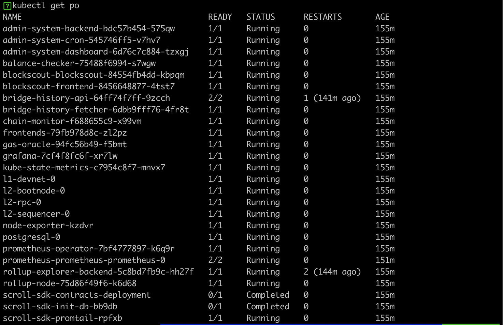
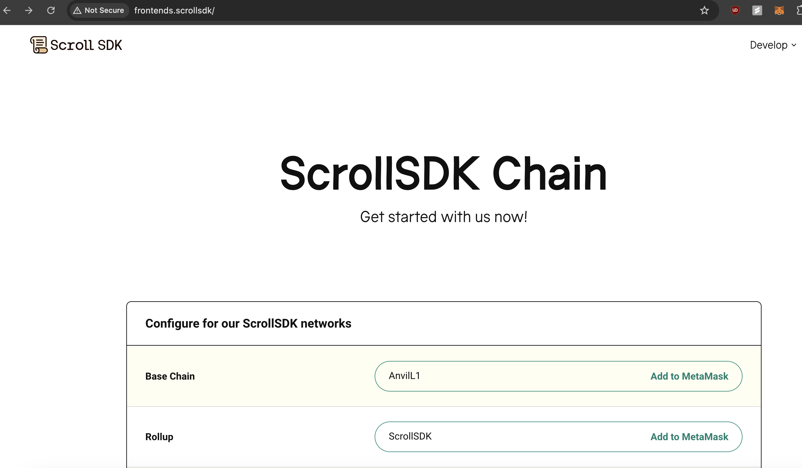
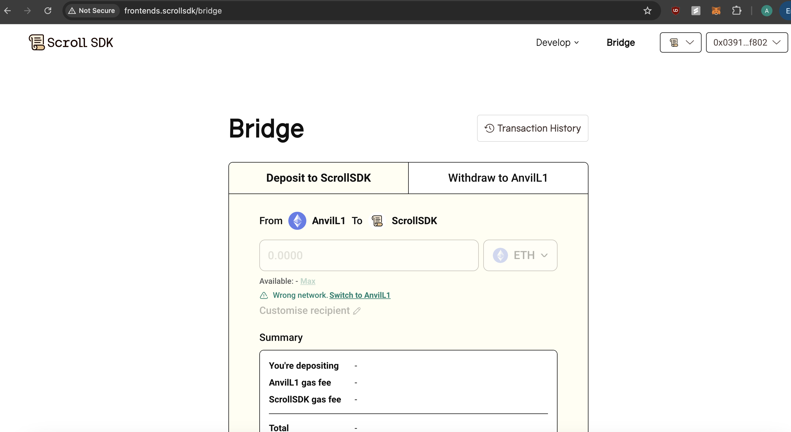
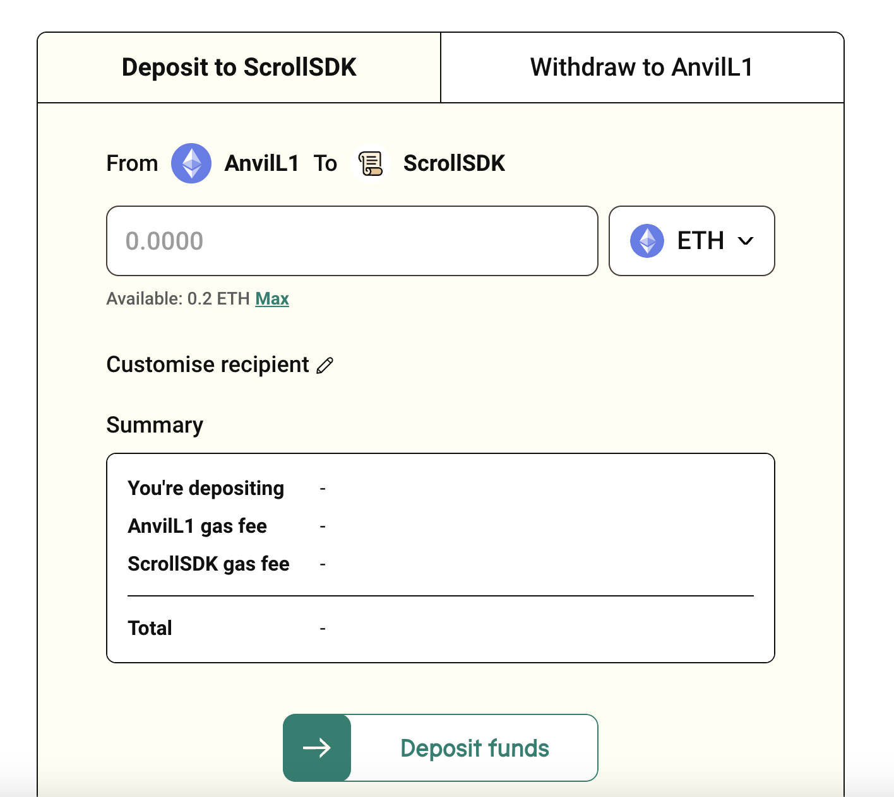
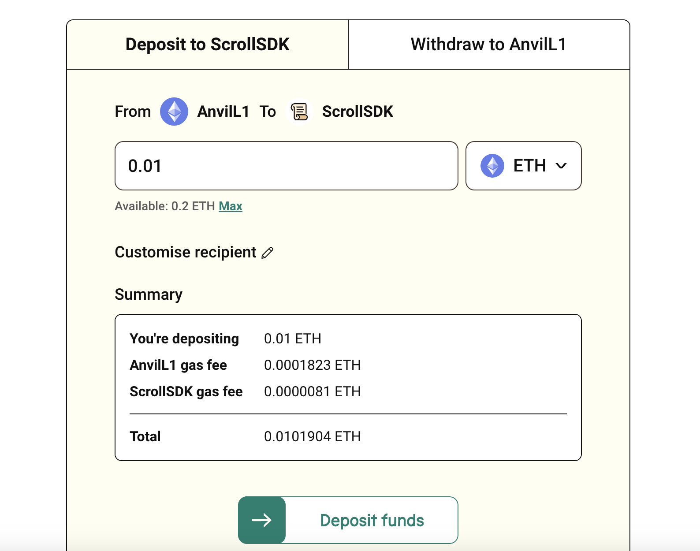
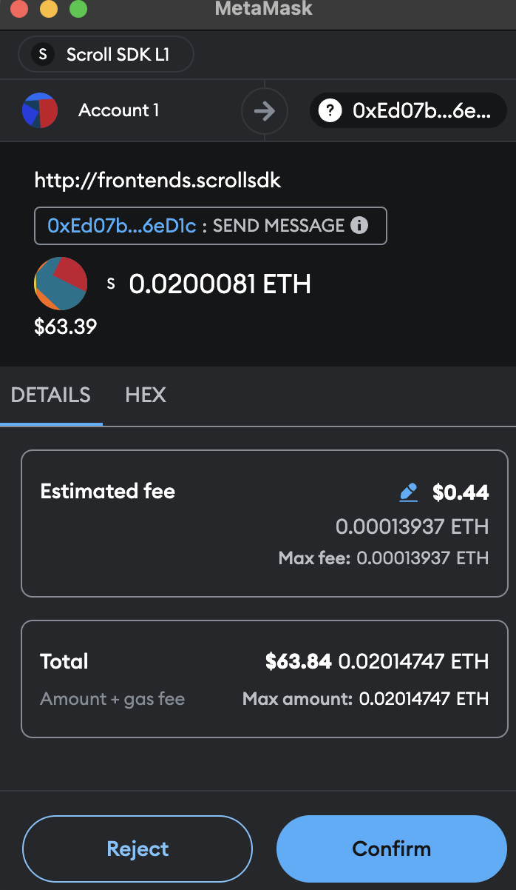

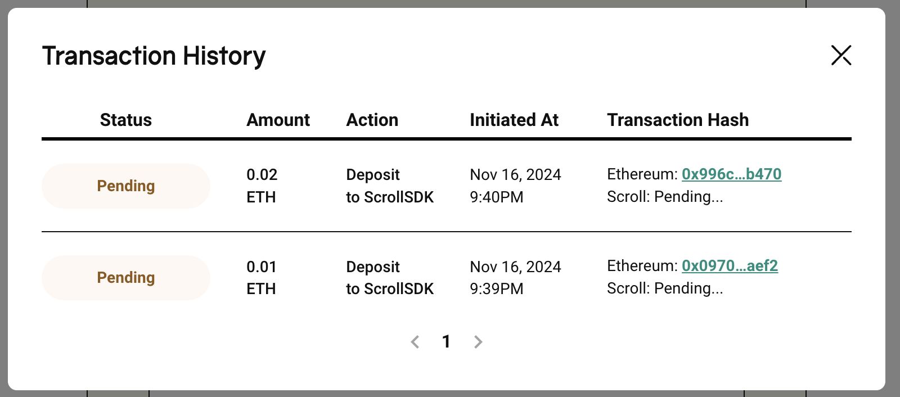
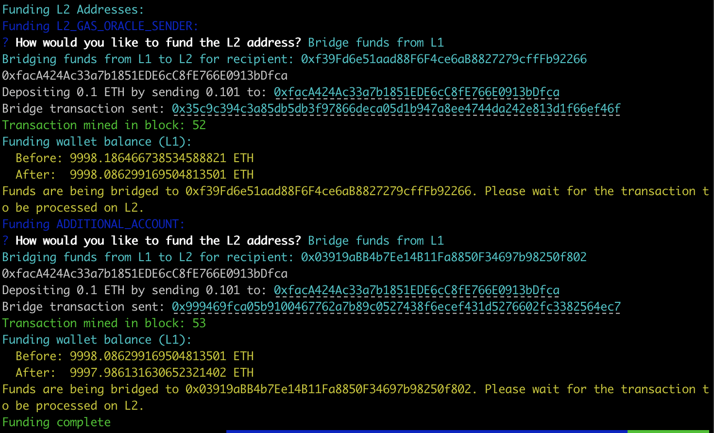
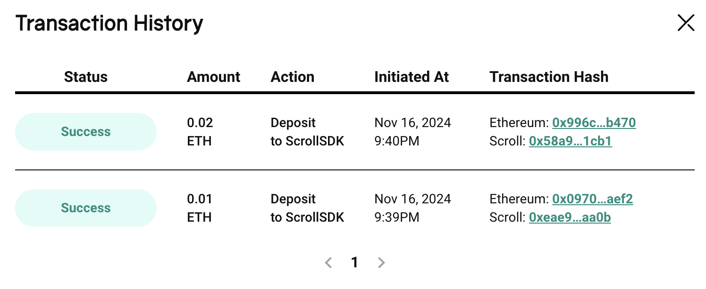
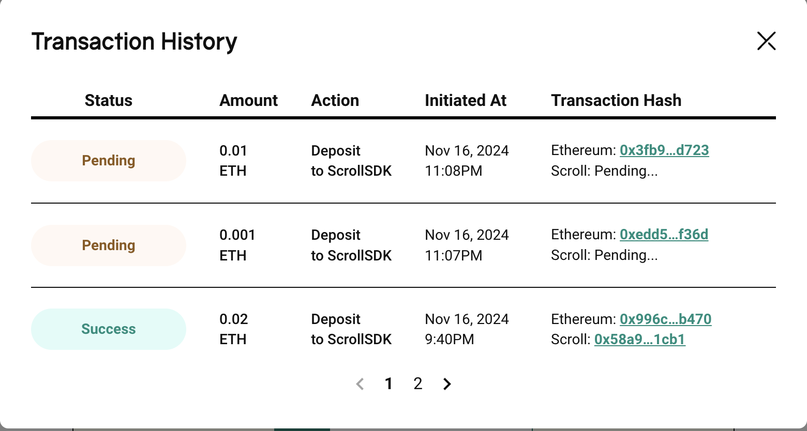
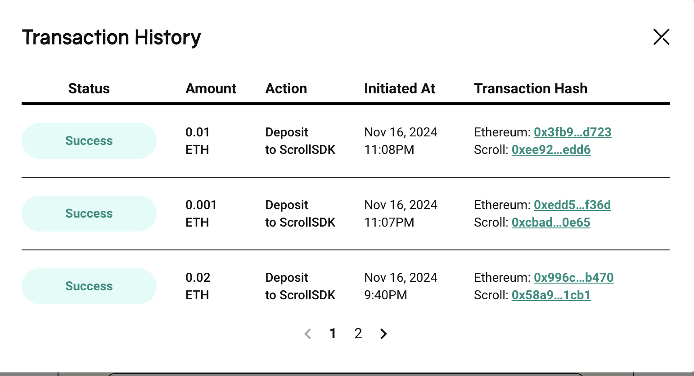
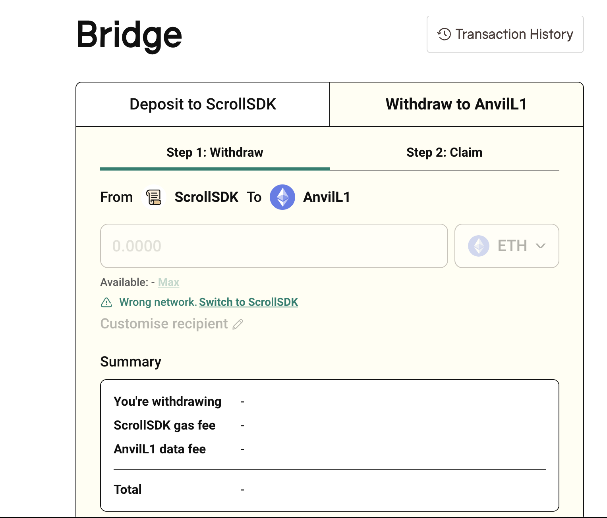
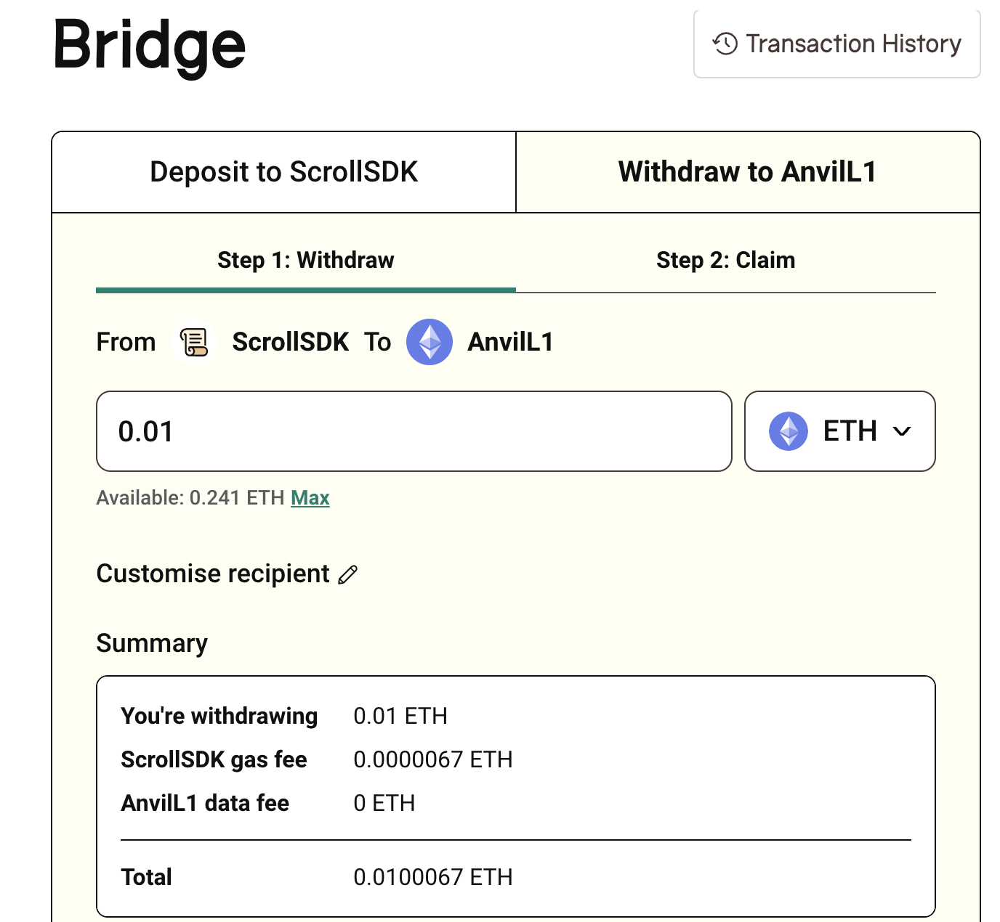
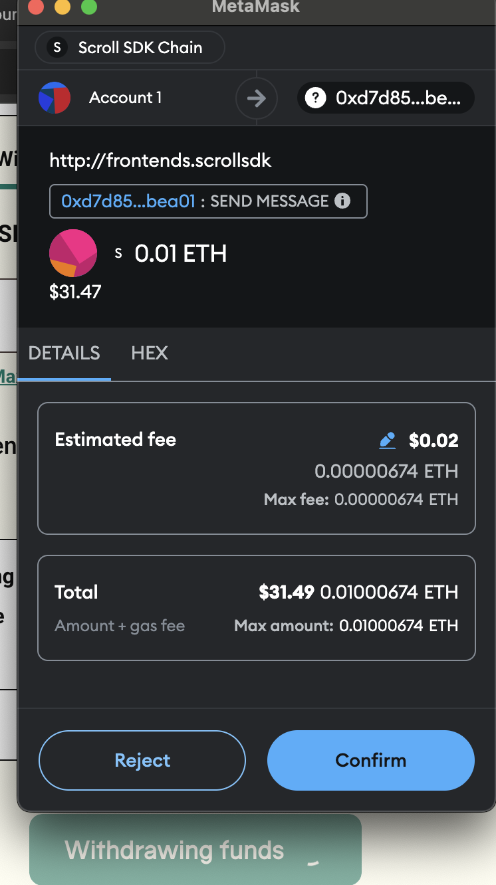
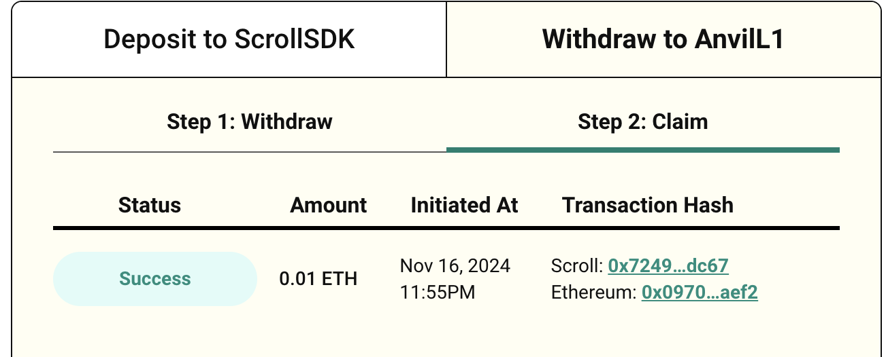
